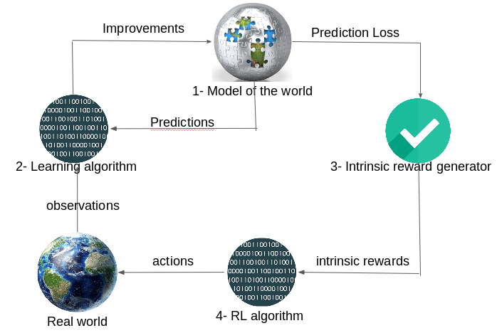

# World Discovery Models

### TLDR;
This paper represents an end-to-end pipeline enabling discovery in
stochastic and partially observable environments.

## Research goals
* Train agents capable of incorporating **novel** information to build
  a global understanding of their worlds
* Built agents capable of selecting useful novelties from random observations
  in stochastic/partially observable environments

## What is discovery ?
It is the ability to learn new knowledge about the world independently from
the task performed and in a self-supervised way. Self-supervision means that
the agent does not rely on a feedback from the environment to learn its
representation of the world.

There are two main discovery mechanisms in the litterature: the first one is 
**active information seeking** which consists in identifying novel information 
from the current knowledge using an internal reward mechanism. The second 
approach aims at building a **model of the world** based on a set of hypothesis 
which encompasses the agent's global view of its environment.

## What are the main components of discovery?
1. **Model of the world** : What we currently know about the world
2. **Learning algorithm** : How to improve the first component predictions
3. **Intrinsic reward generator** : based on the world's model, attributes
a reward to new patterns
4. **RL algorithm** : Used to learn optimal policy regarding the intrinsic
rewards

## How to learn a model of the world?
The model of the world represent our knowledge about the environment. A good
model enables us to predict future states/observations of the world given past
observations and actions.

The paper considers POMDP. So, the real states are not known. That is why, the
agent tries to build a belief state which is a probability distribution over
possible states given the history.

In this work, a RNN (GRU) is used to learn the model of the world. The RNN
takes as inputs : observation features extracted by a CNN and an action. The
model is the hidden state of the RNN. The model is trained using K prediction
tasks consisting in, for each task k, estimating the probability distribution of
the future state conditioned on the current model and the sequence of past actions.

## How to motivate discovery?
To encourage the agent to discuver new information, intrinsic rewards are the
key. This reward is simply a measure of how accurate the predictions of the
model are.

In this paper, the intrinsic reward is the difference between the prediction
error at time _t_ and _t-1_. This quantifies the amount of information gained
after the observation at time _t_.
This reward definition deals with white noise issues and appreciate how much
progress is done to gather new information about the world.

## Takeawyas
* A end-to-end algorithm for discovery is proposed,
* The proposed pipeline overcomes the white noise issues faced by other
  information-seeking methods,
* New intrinsic reward function is proposed to quantify the progress done in
  order to acquire new useful information about the world.

